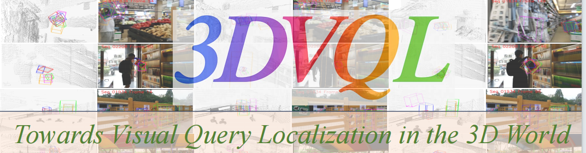
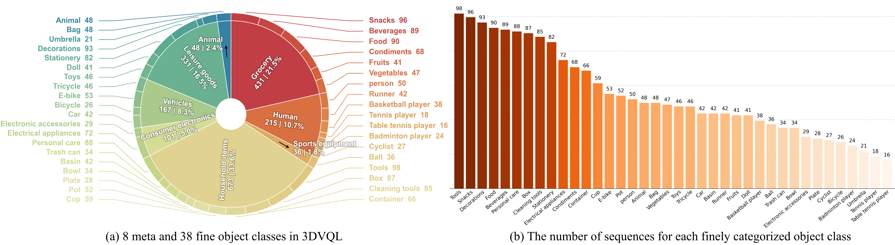

# <p align="center">Towards Visual Query Localization in the 3D World</p>

[**Towards Visual Query Localization in the 3D World**](https://arxiv.org/abs/2605.01498)<br>
Liang Peng<sup>\*</sup>, Bohan Tan<sup>\*</sup>, Zhipeng Zhang<sup>$\ddagger$</sup>, Haobo Li, Yifan Jiao, Xingping Dong<sup>$\dagger$</sup>, Libo Zhang<br>
Wuhan University, AutoLab, SAI, Shanghai Jiao Tong University, Anyverse Dynamics, University of Chinese Academy of Sciences, Institute of Software, Chinese Academy of Sciences<br>
(\*: equal contribution; $\dagger$: first corresponding author; $\ddagger$: second corresponding author)<br>
[[`arXiv`](https://arxiv.org/abs/2605.01498)] [[`Project Page`](https://github.com/wuhengliangliang/3DVQL)] [[`Code`](https://github.com/wuhengliangliang/3DVQL)] [[`Dataset`](https://github.com/wuhengliangliang/3DVQL)]

<br>

<!-- Please replace the following image path with the actual teaser figure in your repository. -->


**Figure:** We introduce [**3DVQL**](https://arxiv.org/abs/2605.01498), the first benchmark towards **3D multimodal visual query localization**. 3DVQL extends visual query localization from 2D videos to 3D multimodal spaces. Each sequence provides aligned **point clouds**, **RGB images**, and **depth images**, enabling query-driven localization of the most recent target occurrence in 3D space.

## :sparkles: Highlights

* **First 3D Multimodal VQL Benchmark**
    - 3DVQL makes the first attempt to study visual query localization in the 3D world, targeting query-driven temporal localization and precise 9 DoF 3D spatial localization.
* **Multimodal 3D Data**
    - Each sequence provides synchronized **point clouds (PC)**, **RGB images**, and **depth images**, supporting PC-only, RGB-D, RGB-PC, and other multimodal 3D VQL settings.
* **Appropriate Scale and Diverse Scenes**
    - 3DVQL contains **2,002** multimodal sequences, around **170K** annotated frames, **6.4K** response track segments, **38** object categories, and **18** diverse real-world environments.
* **High-quality 9 DoF Annotation**
    - 3DVQL provides manual frame-wise **9 DoF 3D bounding box** annotations with multiple rounds of verification and refinement.
* **Baselines and LaF**
    - We build a series of RGB-PC multimodal baselines and propose **LaF**, a Lift-and-Fusion method with depth attention fusion for geometry-aware multimodal alignment.

## :camera: Samples

<!-- Please replace the following image path with the actual sample visualization in your repository. -->


**Figure:** Visualization examples of 3DVQL. Each example sequence contains calibrated point clouds, RGB images, and depth images, together with query-driven response track annotations in 3D space.

## :triangular_flag_on_post: Benchmarking

### :small_blue_diamond: Dataset Statistics

| Split | Sequences | Frames | Tracklets | Object Classes |
|:--|--:|--:|--:|--:|
| 3DVQL<sub>Tra</sub> | 1,601 | 131.4K | 5,157 | 38 |
| 3DVQL<sub>Tst</sub> | 401 | 39.6K | 1,319 | 38 |
| **Total** | **2,002** | **171.0K** | **6,476** | **38** |

3DVQL covers 8 meta categories, including **Grocery**, **Person**, **Sports equipment**, **Household items**, **Consumer electronics**, **Vehicles**, **Leisure goods**, and **Animal**.



### :small_blue_diamond: Evaluation Metrics

We evaluate 3D visual query localization under the Top-1 retrieval setting with the following metrics:

* **tAP**: Temporal Average Precision over temporal IoU thresholds.
* **3D-stAP**: 3D Spatio-Temporal Average Precision over 3D spatio-temporal IoU thresholds.
* **Succ.**: Success rate, where a query is counted as successful if the predicted 3D spatio-temporal IoU is at least 0.05.
* **Rec.%**: Recovery percentage, measuring the percentage of ground-truth response frames whose predicted 3D box overlaps the ground truth with IoU at least 0.5.

### :small_blue_diamond: RGB-PC Baseline Results

| Method | tAP | tAP<sub>0.25</sub> | stAP | stAP<sub>0.05</sub> | Rec.% | Succ. |
|:--|--:|--:|--:|--:|--:|--:|
| AF | 0.181 | 0.442 | 0.003 | 0.015 | 0.093 | 11.693 |
| GAF | 0.291 | 0.597 | 0.015 | 0.075 | 0.049 | 26.309 |
| PAF | 0.224 | 0.577 | 0.021 | 0.104 | 0.115 | 32.156 |
| **LaF** | **0.293** | **0.607** | **0.044** | **0.222** | **0.264** | **46.041** |

### :small_blue_diamond: Ablation on Depth Attention Fusion

| Method | tAP | tAP<sub>0.25</sub> | stAP | stAP<sub>0.05</sub> | Rec.% | Succ. |
|:--|--:|--:|--:|--:|--:|--:|
| LaF w/o DAF | 0.134 | 0.347 | 0.007 | 0.033 | 0.029 | 18.027 |
| **LaF w/ DAF** | **0.293** | **0.607** | **0.044** | **0.222** | **0.264** | **46.041** |

### :small_blue_diamond: Qualitative Evaluation

<!-- Please replace the following image path with the actual qualitative result in your repository. -->


**Figure:** Qualitative comparison of AF, GAF, PAF, LaF, and ground truth on 3DVQL. LaF provides more stable and accurate 9 DoF spatio-temporal localization in complex multimodal 3D scenes.

#### More experimental results and analyses can be found in the [paper](https://arxiv.org/abs/2605.01498).

## :globe_with_meridians: Downloading 3DVQL

The dataset, models, and evaluation toolkit will be released at the project repository:

* **Project Page:** [https://github.com/wuhengliangliang/3DVQL](https://github.com/wuhengliangliang/3DVQL)
* **Dataset:**
You need to download all the zips files using the provided links below for a full version of 3DVQL.

### :small_blue_diamond: Downloading Links
Below are the downloading links of 3DVQL. We offer two ways, `OneDrive` and `Baidu Cloud Drive`, to download the data.

* **OneDrive**
  - The downloading link for the **`training set`** is [here]().
  - The downloading link for the **`test set`** is [here]().

* **Baidu Cloud Drive**
  - The downloading link for the **`training set`** is [here](https://pan.baidu.com/s/1OXkmodDD4GoIOw3wZCM2kg?pwd=DVQL) (you may need the extraction code: `DVQL`).
  - The downloading link for the **`test set`** is [here](https://pan.baidu.com/s/1Dfht77YRegL1FM-igyeTtw?pwd=DVQL) (you may need the extraction code: `DVQL`).

**Note:** The training set of 3DVQL consists of 19 Zip packages. The test set consists of 19 Zip packages.

* **Model Zoo:** coming soon
* **Evaluation Toolkit:** coming soon

### :small_blue_diamond: Recommended Organization

A typical 3DVQL release can be organized as follows:

```text
3DVQL/
├── train/
│   ├── sequence_000001/
│   │   ├── rgb/
│   │   ├── depth/
│   │   ├── point_cloud/
│   │   ├── calibration/
│   │   ├── query/
│   │   └── annotation/
│   │       ├── response_track.json
│   │       └── boxes_9dof.json
│   └── ...
├── test/
│   ├── sequence_000001/
│   │   ├── rgb/
│   │   ├── depth/
│   │   ├── point_cloud/
│   │   ├── calibration/
│   │   ├── query/
│   │   └── annotation/
│   │       ├── response_track.json
│   │       └── boxes_9dof.json
│   └── ...
└── metadata/
    ├── categories.json
    ├── split.json
    └── scenarios.json
```

### :small_blue_diamond: Format of Each Sequence

Each sequence provides multimodal sensor data and annotations for 3D visual query localization:

* **RGB images:** appearance observations from the RGB camera.
* **Depth images:** depth observations aligned with the RGB stream.
* **Point clouds:** 3D observations from LiDAR.
* **Calibration:** intrinsic and extrinsic calibration files for multimodal alignment.
* **Query:** visual query template and its 3D query box.
* **Annotation:** frame-wise visibility, response track segments, and 9 DoF 3D bounding boxes.

All 9 DoF 3D bounding boxes are defined in the camera coordinate system.

## :straight_ruler: Evaluation Toolkit

We will provide a Python evaluation toolkit for 3DVQL. The toolkit will support the official evaluation metrics used in our paper, including **tAP**, **3D-stAP**, **Succ.**, and **Rec.%**.

```bash

# Example usage, to be updated after release
git clone https://github.com/wuhengliangliang/3DVQL
cd VQL3D

conda env create -f environment.yml
conda activate VQL3D

######### train #########
bash train.sh

######### eval #########
# build gt file
python build_gt_file.py \
    --data-path your_data_path \
    --out output/VQLOC/infer_outputs/like_ego4d/_gt.json.gz

bash inference_predict.sh

# build pred file
bash inference_results.sh


# eval
python ./evaluate.py
```

## :wrench: Method Overview

<!-- Please replace the following image path with the actual framework figure in your repository. -->


**LaF** lifts 2D image features into the 3D space and performs depth-aware attention with 3D voxel features. The geometry-aware fusion module aligns RGB and point cloud features under the camera frustum, followed by query-conditioned spatial reasoning, spatio-temporal modeling, and 9 DoF 3D box prediction.

## :memo: License and Responsible Usage

3DVQL is released to promote research on multimodal 3D visual query localization. The dataset and benchmark are intended for **research purposes only**. Please follow the license terms in the official release.

## :balloon: Citation

If you find 3DVQL useful, please consider giving this repository a star and citing our paper. Thanks!

```bibtex
@article{peng2026towards,
  title={Towards Visual Query Localization in the 3D World},
  author={Liang Peng and Bohan Tan and Zhipeng Zhang and Haobo Li and Yifan Jiao and Xingping Dong and Libo Zhang},
  journal={arXiv preprint arXiv:2605.01498},
  year={2026}
}
```
